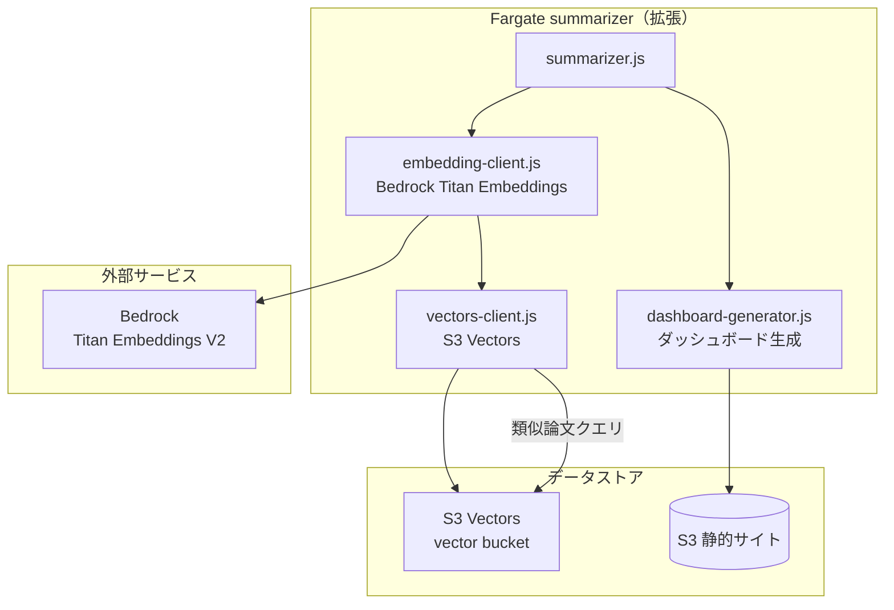

# Phase 3 設計 — Web ダッシュボード + セマンティック検索

## 1. 実装アプローチ

### 全体方針

**全て静的サイト生成（SSG）で実現する。** サーバーサイド API は追加しない。

- 日次バッチの summarizer（Fargate）を拡張し、要約生成と同時にダッシュボード関連ページも生成
- 検索はクライアントサイド JavaScript で実行（lunr.js + 静的 JSON インデックス）
- 類似論文はバッチ処理で事前計算し、HTML に埋め込む

### 実装順序

```
Step 1: S3 Vectors 環境構築（vector bucket + vector index）
Step 2: summarizer 拡張（埋め込み生成 + S3 Vectors 保存 + 類似論文計算）
Step 3: 詳細ページテンプレート更新（類似論文セクション追加）
Step 4: ダッシュボードページ生成（トップ、日付別、タグ別）
Step 5: クライアントサイド検索（lunr.js + JSON インデックス）
Step 6: 統合テスト・デプロイ
```

## 2. アーキテクチャ変更

### 変更前（Phase 1/2）

```
Fargate summarizer → DynamoDB + S3（論文詳細 HTML + ダイジェスト HTML）
```

### 変更後（Phase 3）

```
Fargate summarizer
  ├→ DynamoDB（要約保存）
  ├→ Bedrock Titan Embeddings（ベクトル生成）
  ├→ S3 Vectors（ベクトル保存 + 類似論文クエリ）
  └→ S3 静的サイト
       ├── papers/{arxiv_id}.html（詳細ページ + 類似論文セクション）
       ├── digest/{date}.html（日次ダイジェスト）
       ├── tags/{tag}.html（タグ別一覧）
       ├── search-index.json（全文検索インデックス）
       └── index.html（トップページ → 最新ダイジェストへリダイレクト）
```

### システム構成図（追加分のみ）



## 3. コンポーネント設計

### 3.1 embedding-client.js（新規）

**責務:** 論文のテキストから768次元のベクトル埋め込みを生成する

```javascript
// Bedrock Titan Embeddings V2 を使用
const { BedrockRuntimeClient, InvokeModelCommand } = require('@aws-sdk/client-bedrock-runtime');

async function generateEmbedding(text) {
  const client = new BedrockRuntimeClient({ region: 'ap-northeast-1' });
  const response = await client.send(new InvokeModelCommand({
    modelId: 'amazon.titan-embed-text-v2:0',
    contentType: 'application/json',
    body: JSON.stringify({
      inputText: text,
      dimensions: 768,
      normalize: true,
    }),
  }));
  const result = JSON.parse(new TextDecoder().decode(response.body));
  return result.embedding; // float32[768]
}
```

**入力テキスト:** `title + " " + compact_summary`（タイトルとコンパクト要約を結合）

**コスト:** ~$0.00002/1K tokens × ~200 tokens/論文 × 7論文/日 ≈ $0.00003/日 ≈ $0.001/月

### 3.2 vectors-client.js（新規）

**責務:** S3 Vectors にベクトルを保存・クエリする

```javascript
const { S3VectorsClient, PutVectorsCommand, QueryVectorsCommand } = require('@aws-sdk/client-s3vectors');

// ベクトル保存
async function putVector(arxivId, embedding, metadata) {
  await client.send(new PutVectorsCommand({
    vectorBucketName: VECTOR_BUCKET,
    vectorIndexName: VECTOR_INDEX,
    vectors: [{
      key: arxivId,
      data: { float32: embedding },
      metadata: {
        title: metadata.title_ja,
        compact_summary: metadata.compact_summary,
        tags: metadata.tags.join(','),
        date: metadata.date,
      },
    }],
  }));
}

// 類似論文クエリ
async function querySimilar(embedding, topK = 5, excludeKey = null) {
  const response = await client.send(new QueryVectorsCommand({
    vectorBucketName: VECTOR_BUCKET,
    vectorIndexName: VECTOR_INDEX,
    queryVector: { float32: embedding },
    topK: topK + 1, // 自分自身を除外するため+1
  }));
  return response.vectors
    .filter(v => v.key !== excludeKey)
    .slice(0, topK);
}
```

**S3 Vectors 構成:**
- Vector bucket: `ai-papers-digest-vectors`
- Vector index: `paper-embeddings`（dimension=768, metric=cosine）

### 3.3 dashboard-generator.js（新規）

**責務:** ダッシュボードの静的ページ群を生成し S3 にアップロードする

**生成するページ:**

| ページ | パス | 内容 |
|--------|------|------|
| トップ | `index.html` | 最新ダイジェストへの自動リダイレクト |
| 日次ダイジェスト | `digest/{date}.html` | 既存（テンプレート更新のみ） |
| 論文詳細 | `papers/{arxiv_id}.html` | 既存 + 類似論文セクション追加 |
| タグ一覧 | `tags/index.html` | 全タグの一覧（論文数付き） |
| タグ別 | `tags/{tag}.html` | 特定タグの論文一覧 |
| 検索インデックス | `search-index.json` | lunr.js 用の全文検索インデックス |
| 検索ページ | `search.html` | 検索 UI + クライアントサイド検索 |

**処理フロー（日次バッチ内）:**

```
1. 当日の要約生成完了後に実行
2. DynamoDB から全 summaries を取得（is_active=true）
3. タグ集計 → tags/index.html + tags/{tag}.html 生成
4. 全要約の検索インデックス → search-index.json 生成
5. index.html を最新日付にリダイレクト更新
6. S3 にアップロード + CloudFront invalidation
```

### 3.4 summarizer.js の拡張

現在の処理フローに以下を追加：

```
既存:
  論文ごと: DynamoDB読取 → Claude要約 → DynamoDB保存 → S3 HTML

追加:
  論文ごと: → Bedrock埋め込み生成 → S3 Vectors保存
  全論文完了後: → S3 Vectors類似論文クエリ → 詳細HTML再生成（類似論文付き）
  全論文完了後: → ダッシュボードページ生成
```

**フロー詳細:**

```javascript
async function main() {
  const paperIds = JSON.parse(process.env.PAPER_IDS);
  const date = process.env.TARGET_DATE;

  // Phase 1: 要約生成 + 埋め込み + ベクトル保存
  for (const arxivId of paperIds) {
    const paper = await dynamoClient.getPaper(arxivId);
    const summary = await claudeClient.generateSummary(paper);
    await dynamoClient.putSummary(arxivId, summary, date);

    // Phase 3 追加: 埋め込み生成 + S3 Vectors 保存
    const text = `${summary.title_original} ${summary.compact_summary}`;
    const embedding = await embeddingClient.generateEmbedding(text);
    await vectorsClient.putVector(arxivId, embedding, { ...summary, date });

    await sleep(10_000);
  }

  // Phase 3 追加: 類似論文クエリ + 詳細ページ再生成
  for (const arxivId of paperIds) {
    const paper = await dynamoClient.getPaper(arxivId);
    const summary = await dynamoClient.getSummary(arxivId);
    const embedding = await vectorsClient.getVector(arxivId);
    const similar = await vectorsClient.querySimilar(embedding, 5, arxivId);
    const html = htmlGenerator.renderDetail(paper, summary, similar);
    await s3Uploader.upload(`papers/${arxivId}.html`, html);
  }

  // Phase 3 追加: ダッシュボードページ生成
  await dashboardGenerator.generate(date);
}
```

## 4. データ構造

### S3 Vectors

| 項目 | 値 |
|------|-----|
| Vector bucket | `ai-papers-digest-vectors` |
| Vector index | `paper-embeddings` |
| Dimension | 768 |
| Distance metric | cosine |
| Vector key | arxiv_id |
| Metadata | title(S), compact_summary(S), tags(S), date(S) |

### 検索インデックス（search-index.json）

```json
{
  "version": 1,
  "papers": [
    {
      "id": "2603.18718",
      "title": "Scaling Laws for Neural Language Models",
      "title_ja": "ニューラル言語モデルのスケーリング則",
      "compact_summary": "言語モデルの性能は...",
      "tags": ["LLM", "Scaling"],
      "date": "2026-03-27",
      "url": "/papers/2603.18718.html"
    }
  ]
}
```

クライアントサイドで lunr.js がこの JSON をロードし、title_ja + compact_summary + tags を対象にインクリメンタル検索する。

## 5. テンプレート設計

### 詳細ページ（paper-detail.html）変更点

既存テンプレートの末尾に類似論文セクションを追加：

```html
<!-- 類似論文セクション（Phase 3 追加） -->
{{#if similar_papers}}
<section class="similar-papers">
  <h2>📌 類似論文</h2>
  {{#each similar_papers}}
  <div class="similar-card">
    <a href="/papers/{{this.key}}.html">
      <strong>{{this.title}}</strong>
    </a>
    <p>{{this.compact_summary}}</p>
    <span class="similarity">類似度: {{this.score}}</span>
  </div>
  {{/each}}
</section>
{{/if}}
```

### 検索ページ（search.html）

```html
<div id="search-container">
  <input type="text" id="search-input" placeholder="キーワードで検索...">
  <div id="search-results"></div>
</div>
<script src="https://unpkg.com/lunr@2.3.9/lunr.min.js"></script>
<script src="/assets/search.js"></script>
```

### search.js

```javascript
let idx, papers;

fetch('/search-index.json')
  .then(r => r.json())
  .then(data => {
    papers = data.papers;
    idx = lunr(function() {
      this.ref('id');
      this.field('title_ja', { boost: 2 });
      this.field('compact_summary');
      this.field('tags', { boost: 1.5 });
      papers.forEach(p => this.add(p));
    });
  });

document.getElementById('search-input').addEventListener('input', function(e) {
  const query = e.target.value.trim();
  if (query.length < 2) return;
  const results = idx.search(query);
  // 結果を表示...
});
```

## 6. IAM 権限の追加

Fargate タスクロールに以下を追加：

```
s3vectors:CreateVectorBucket
s3vectors:CreateVectorIndex
s3vectors:PutVectors
s3vectors:GetVectors
s3vectors:QueryVectors
s3vectors:ListVectorIndexes
bedrock:InvokeModel  (amazon.titan-embed-text-v2:0)
```

## 7. コスト見積もり（Phase 3 追加分）

| コンポーネント | 月額 |
|--------------|------|
| S3 Vectors（ストレージ + クエリ） | < $0.05 |
| Bedrock Titan Embeddings | < $0.01 |
| S3 静的ページ増加分 | < $0.01 |
| lunr.js（CDN） | $0 |
| **合計** | **< $0.10** |

## 8. 影響範囲

| コンポーネント | 変更内容 |
|--------------|---------|
| `src/summarizer/src/summarizer.js` | 埋め込み + ベクトル保存 + 類似論文 + ダッシュボード生成を追加 |
| `src/summarizer/templates/paper-detail.html` | 類似論文セクション追加 |
| `src/summarizer/templates/daily-digest.html` | ナビゲーション追加（タグ、検索リンク） |
| `static/style.css` | 類似論文カード、検索UI、タグページのスタイル追加 |
| `terraform/environments/prod/main.tf` | ECS タスクロールに s3vectors + bedrock 権限追加 |
| 新規: `src/summarizer/src/embedding-client.js` | Bedrock 埋め込み生成 |
| 新規: `src/summarizer/src/vectors-client.js` | S3 Vectors 操作 |
| 新規: `src/summarizer/src/dashboard-generator.js` | ダッシュボードページ生成 |
| 新規: `src/summarizer/templates/tag-list.html` | タグ一覧テンプレート |
| 新規: `src/summarizer/templates/tag-page.html` | タグ別一覧テンプレート |
| 新規: `src/summarizer/templates/search.html` | 検索ページテンプレート |
| 新規: `static/search.js` | クライアントサイド検索ロジック |

## 9. リスク

| リスク | 影響 | 軽減策 |
|--------|------|--------|
| S3 Vectors SDK が Node.js で未提供 | vectors-client.js が実装不可 | boto3（Python Lambda）にフォールバック、または AWS SDK v3 の最新版を確認 |
| Bedrock Titan Embeddings が ap-northeast-1 で未提供 | 埋め込み生成不可 | Semantic Scholar SPECTER2 embedding を代替使用 |
| lunr.js が日本語トークナイズに非対応 | 日本語検索の精度が低い | TinySegmenter を lunr.js のトークナイザーとして追加 |
| search-index.json のサイズ増大（1年後 ~2,500件） | 初回ロード遅延 | 圧縮（gzip）+ 直近3ヶ月のみインデックス化、古い分は月別分割 |
