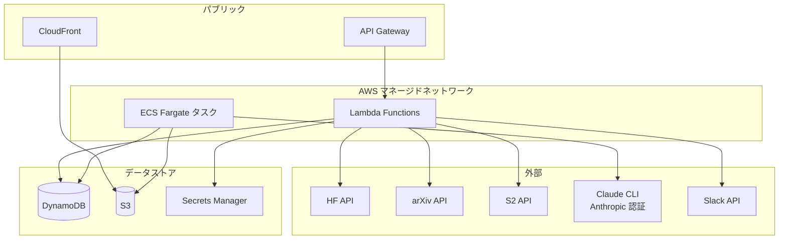
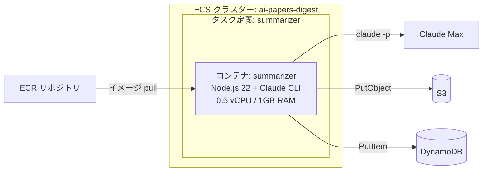
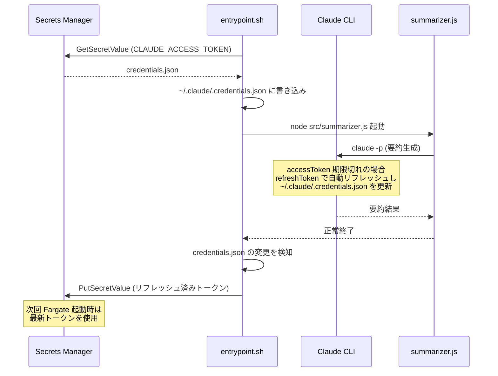
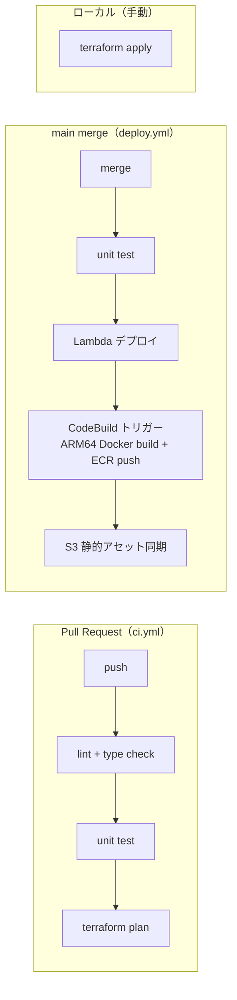

# 技術仕様書

## 1. テクノロジースタック

### ランタイム・言語

| レイヤー | 技術 | バージョン | 選定理由 |
|---------|------|-----------|---------|
| Lambda ランタイム | Python 3.12 | 3.12.x | AWS SDK（boto3）との親和性、arXiv XML パース（feedparser）、軽量スクリプトに最適 |
| Fargate コンテナ | Node.js 22 LTS | 22.x | Claude CLI（npm パッケージ `@anthropic-ai/claude-code`）のネイティブ実行環境 |
| IaC | Terraform | >= 1.9 | AWS リソース管理の業界標準、状態管理・モジュール化が容易 |
| CI/CD | GitHub Actions | - | リポジトリ統合、Terraform plan/apply の自動化 |

### AWS サービス一覧

| サービス | 用途 | Phase | 構成 |
|---------|------|-------|------|
| **Lambda** | データ収集、スコアリング、Slack配信、フィードバック収集 | 1〜2 | Python 3.12, arm64 |
| **ECS Fargate** | 要約生成（Claude CLI）+ S3 ページ生成 | 1 | スポットタスク、日次起動 |
| **ECR** | Fargate 用 Docker イメージ管理 | 1 | プライベートリポジトリ、MUTABLE タグ（`latest` 更新用）、プッシュ時スキャン有効 |
| **EventBridge** | 日次/週次スケジュール、ECS タスク状態変更イベント | 1〜2 | スケジュールルール + イベントルール |
| **DynamoDB** | 論文・要約・フィードバック・設定の永続化 | 1〜2 | オンデマンドキャパシティ |
| **S3** | 詳細ページ静的ホスティング、日次ダイジェストページ | 1 | 静的ウェブサイトホスティング |
| **CloudFront** | S3 静的サイトの CDN 配信 | 1 | OAC（Origin Access Control） |
| **Secrets Manager** | Slack Webhook URL、Semantic Scholar API キー等 | 1 | 自動ローテーションなし（手動管理） |
| **CloudWatch** | ログ集約、メトリクス、アラーム | 1 | Logs, Metrics, Alarms |
| **SNS** | アラート通知 | 1 | メール通知、aws/sns マネージドキー暗号化 |
| **SQS** | Dead Letter Queue（Lambda DLQ） | 1 | 標準キュー、SSE-SQS 暗号化有効 |
| **API Gateway** | Slack Events API のエンドポイント | 2 | HTTP API（v2） |
| **S3 Vectors** | ベクトル検索（セマンティック検索） | 3 | vector bucket + vector index、ゼロスケール、従量課金 |

### 外部サービス

| サービス | 用途 | 認証 |
|---------|------|------|
| Claude Max プラン | LLM 要約生成（`claude -p` CLI） | Max サブスクリプション認証 |
| arXiv API | 論文メタデータ取得 | 認証不要 |
| Hugging Face Papers API | 論文リスト + upvote 取得 | 認証不要 |
| Semantic Scholar API | 引用数・TLDR 取得 | API キー（無料） |
| Slack API | メッセージ配信 + リアクション収集 | Webhook URL + Bot Token |

## 2. インフラストラクチャ構成

### AWS アカウント・リージョン

| 項目 | 値 |
|------|-----|
| AWS リージョン | ap-northeast-1（東京） |
| 環境 | 単一環境（prod） ※ 小規模のため dev/staging は設けない |

### ネットワーク構成

本システムはサーバーレス中心のため、VPC は最小限とする。



**VPC 構成の判断:**
- Lambda: VPC 外で実行（外部 API アクセスが主目的、VPC 接続は不要）
- Fargate: awsvpc モード必須。パブリックサブネットで外部APIアクセスを確保
  - **セキュリティグループ: インバウンド全拒否**（外部からの接続受付なし、アウトバウンドのみ HTTPS 443 許可）
  - 本来はプライベートサブネット + NAT Gateway が望ましいが、個人利用のため NAT Gateway コスト（~$30/月）は見合わない
- DynamoDB: VPC エンドポイント不要（IAM 認証 + HTTPS で十分）

**Phase 3 で VPC が必要になる場合:**
- S3 Vectors は VPC 不要（AWS PrivateLink 対応だが、本アプリの規模では不要）

### ECS Fargate タスク構成



| 設定 | 値 | 理由 |
|------|-----|------|
| 起動タイプ | FARGATE | サーバーレス、日次のみ稼働 |
| キャパシティプロバイダー | FARGATE_SPOT | コスト最小化（中断時はリトライで対応） |
| CPU | 0.5 vCPU | Claude CLI 実行に十分 |
| メモリ | 1 GB | JSON パース + HTML テンプレート生成 |
| プラットフォーム | Linux/ARM64 | Graviton、コスト20%削減 |
| エフェメラルストレージ | 21 GB（デフォルト） | 十分 |
| タスクタイムアウト | 30 分 | パイプライン全体のSLA に合わせる |

### S3 + CloudFront 構成

```
┌──────────────┐     ┌──────────────┐     ┌──────────────┐
│  CloudFront  │────▶│     S3       │     │              │
│  ディストリ   │ OAC │  バケット     │     │  ユーザー     │
│  ビューション  │────▶│              │     │  (ブラウザ)   │
└──────────────┘     └──────────────┘     └──────────────┘
       ▲                                         │
       └─────────────────────────────────────────┘
                 HTTPS アクセス
```

| 設定 | 値 |
|------|-----|
| S3 バケット名 | `ai-papers-digest-pages-{account_id}` |
| S3 パブリックアクセス | 全ブロック（CloudFront OAC 経由のみ） |
| S3 バージョニング | 無効（静的生成ページのため不要） |
| S3 ライフサイクル | 90日経過 → S3 Intelligent-Tiering に移行（古いページのコスト最適化） |
| CloudFront オリジン | S3（OAC 使用） |
| キャッシュポリシー | CachingDisabled（個人利用・低トラフィック・日次更新のためキャッシュ不要） |
| 価格クラス | PriceClass_200（東京エッジロケーションを含む最小クラス） |
| 地理的制限 | 許可リスト: JP のみ（個人利用・日本からのアクセス限定） |
| デフォルトルートオブジェクト | index.html |
| SSL 証明書 | CloudFront デフォルト証明書（*.cloudfront.net） |

**S3 バケット構造:**
```
s3://ai-papers-digest-pages-{account_id}/
├── index.html                          # トップページ（最新ダイジェストへリダイレクト）
├── search.html                         # 検索ページ（lunr.js クライアントサイド検索）
├── search-index.json                   # lunr.js 用全文検索インデックス
├── assets/
│   ├── style.css                       # 共通スタイルシート
│   └── search.js                       # 検索ロジック（lunr.js）
├── digest/
│   ├── 2026-04-04.html                 # 日次ダイジェストページ
│   └── ...
├── papers/
│   ├── 2604.02002.html                 # 論文詳細ページ（類似論文セクション付き）
│   └── ...
└── tags/
    ├── index.html                      # タグ一覧ページ
    ├── LLM.html                        # タグ別論文一覧
    ├── 強化学習.html
    └── ...
```

## 3. Lambda 関数仕様

### 共通設定

| 設定 | 値 |
|------|-----|
| ランタイム | Python 3.12 |
| アーキテクチャ | arm64（Graviton2） |
| ログレベル | 環境変数 `LOG_LEVEL` で制御（デフォルト: INFO） |
| レイヤー | 共通依存パッケージ用 Lambda Layer 1つ |
| トレーシング | AWS X-Ray 有効 |

### 関数一覧

#### collector（論文収集）

| 設定 | 値 |
|------|-----|
| 関数名 | `ai-papers-digest-collector` |
| メモリ | 256 MB |
| タイムアウト | 300 秒（5分） |
| トリガー | EventBridge スケジュール（JST 6:00） |
| 環境変数 | `PAPERS_TABLE`, `SCORER_FUNCTION_NAME`, `S2_API_KEY_SECRET_ARN`, `TARGET_CATEGORIES` |
| DLQ | SQS `ai-papers-digest-collector-dlq` |
| 同時実行数 | 1（日次バッチなので並行不要） |

**依存パッケージ:**
- `boto3` （Lambda ランタイム同梱）
- `feedparser` — arXiv Atom XML パース
- `requests` — HTTP クライアント

#### scorer（スコアリング）

| 設定 | 値 |
|------|-----|
| 関数名 | `ai-papers-digest-scorer` |
| メモリ | 256 MB |
| タイムアウト | 120 秒（2分） |
| トリガー | collector Lambda からの非同期呼び出し |
| 環境変数 | `PAPERS_TABLE`, `DELIVERY_LOG_TABLE`, `CONFIG_TABLE`, `ECS_CLUSTER`, `ECS_TASK_DEFINITION`, `ECS_SUBNETS`, `ECS_SECURITY_GROUP`, `TOP_N` |
| DLQ | SQS `ai-papers-digest-scorer-dlq` |

#### deliverer（Slack 配信）

| 設定 | 値 |
|------|-----|
| 関数名 | `ai-papers-digest-deliverer` |
| メモリ | 128 MB |
| タイムアウト | 120 秒（2分） |
| トリガー | EventBridge ルール（ECS Task State Change: STOPPED） |
| 環境変数 | `SUMMARIES_TABLE`, `DELIVERY_LOG_TABLE`, `SLACK_WEBHOOK_SECRET_ARN`, `DETAIL_PAGE_BASE_URL` |
| DLQ | SQS `ai-papers-digest-deliverer-dlq` |

#### feedback-collector（フィードバック収集）【Phase 2】

| 設定 | 値 |
|------|-----|
| 関数名 | `ai-papers-digest-feedback` |
| メモリ | 128 MB |
| タイムアウト | 30 秒 |
| トリガー | API Gateway HTTP API |
| 環境変数 | `FEEDBACK_TABLE`, `DELIVERY_LOG_TABLE`, `SLACK_SIGNING_SECRET_ARN` |

**API Gateway（Phase 2）セキュリティ設定:**

| 設定 | 値 | 理由 |
|------|-----|------|
| タイプ | HTTP API（v2） | 低コスト |
| スロットリング | 10 req/sec, バースト 20 | Slack Events の頻度に十分、DDoS 軽減 |
| 認証 | なし（Slack 署名検証はアプリ層で実施） | Slack Events API は署名ヘッダーで認証 |
| CORS | 無効 | ブラウザからのアクセスなし |
| アクセスログ | 有効（CloudWatch Logs） | 不正アクセス検知用 |

#### weight-adjuster（ウェイト再計算）【Phase 2】

| 設定 | 値 |
|------|-----|
| 関数名 | `ai-papers-digest-weight-adjuster` |
| メモリ | 256 MB |
| タイムアウト | 120 秒（2分） |
| トリガー | EventBridge スケジュール（週次、月曜 JST 5:00） |
| 環境変数 | `FEEDBACK_TABLE`, `PAPERS_TABLE`, `CONFIG_TABLE` |

## 4. コンテナイメージ仕様（Fargate summarizer）

### Dockerfile 設計

```dockerfile
FROM node:22-slim

# Claude CLI インストール
RUN npm install -g @anthropic-ai/claude-code

# 作業ディレクトリ
WORKDIR /app

# アプリケーションコード
COPY package.json ./
RUN npm install --production
COPY src/ ./src/
COPY templates/ ./templates/

# エントリポイント（トークン配置 → アプリ実行 → トークン書き戻し）
COPY entrypoint.sh ./
RUN chmod +x entrypoint.sh
ENTRYPOINT ["./entrypoint.sh"]
```

### コンテナ内アプリケーション構造

```
/app/
├── entrypoint.sh              # トークン配置 → アプリ実行 → トークン書き戻し
├── src/
│   ├── summarizer.js          # メインエントリポイント
│   ├── claude-client.js       # claude -p ラッパー
│   ├── dynamo-client.js       # DynamoDB 読み書き
│   ├── s3-uploader.js         # S3 HTML アップロード
│   ├── html-generator.js      # HTML テンプレートレンダリング
│   ├── quality-judge.js       # LLM-as-judge 品質比較
│   ├── embedding-client.js    # Bedrock Titan Embeddings V2（1024次元）
│   └── vectors-client.js      # S3 Vectors 読み書き・類似検索
├── templates/
│   ├── paper-detail.html      # 論文詳細ページテンプレート（類似論文セクション含む）
│   └── daily-digest.html      # 日次ダイジェストページテンプレート
├── package.json
└── package-lock.json
```

### Claude CLI 実行方式

```javascript
// claude-client.js の概要
const { execSync } = require('child_process');

function generateSummary(paperData) {
  const prompt = buildPrompt(paperData);

  // stdin でプロンプトを渡し、JSON で結果を取得
  const result = execSync(
    'claude -p --output-format json --max-turns 1',
    {
      input: prompt,
      encoding: 'utf-8',
      timeout: 120_000,  // 1論文あたり最大2分
      maxBuffer: 1024 * 1024,  // 1MB
    }
  );

  return JSON.parse(result);
}
```

### 認証方式

Claude Max プランの OAuth 認証トークンを Secrets Manager 経由で Fargate タスクに渡す。

| 方式 | 設定 |
|------|------|
| **OAuth トークン** | Secrets Manager からトークン（`credentials.json` 全体）を取得し、環境変数 `CLAUDE_ACCESS_TOKEN` に設定 |

**トークン自動リフレッシュの仕組み:**



- Claude CLI は `accessToken` 期限切れ時に `refreshToken` を使って自動的に新しいトークンを取得する
- `entrypoint.sh` がタスク終了時にトークンの変更を検知し、Secrets Manager に書き戻す
- これにより `refreshToken` が有効な限り、手動でのトークン更新は不要
- `refreshToken` 自体が失効した場合は、ローカルで `claude auth login` を実行し Secrets Manager を手動更新する

## 5. Terraform 構成

### ディレクトリ構成

```
terraform/
├── main.tf                    # プロバイダー設定、バックエンド設定
├── variables.tf               # 入力変数定義
├── outputs.tf                 # 出力値定義
├── terraform.tfvars           # 変数値（.gitignore 対象）
│
├── modules/
│   ├── dynamodb/              # DynamoDB テーブル定義
│   │   ├── main.tf
│   │   ├── variables.tf
│   │   └── outputs.tf
│   │
│   ├── lambda/                # Lambda 関数定義（共通モジュール）
│   │   ├── main.tf
│   │   ├── variables.tf
│   │   └── outputs.tf
│   │
│   ├── ecs/                   # ECS クラスター + タスク定義
│   │   ├── main.tf
│   │   ├── variables.tf
│   │   └── outputs.tf
│   │
│   ├── s3-cloudfront/         # S3 バケット + CloudFront
│   │   ├── main.tf
│   │   ├── variables.tf
│   │   └── outputs.tf
│   │
│   ├── eventbridge/           # スケジュール + イベントルール
│   │   ├── main.tf
│   │   ├── variables.tf
│   │   └── outputs.tf
│   │
│   ├── monitoring/            # CloudWatch Alarms + SNS
│   │   ├── main.tf
│   │   ├── variables.tf
│   │   └── outputs.tf
│   │
│   ├── api-gateway/           # API Gateway（Phase 2）
│   │   ├── main.tf
│   │   ├── variables.tf
│   │   └── outputs.tf
│   │
│   ├── s3-vectors/            # S3 Vectors ベクトル検索（Phase 3）
│   │   ├── main.tf
│   │   ├── variables.tf
│   │   └── outputs.tf
│   │
│   ├── github-oidc/           # GitHub OIDC + IAM ロール（CI/CD 認証）
│   │   ├── main.tf
│   │   ├── variables.tf
│   │   └── outputs.tf
│   │
│   └── codebuild/             # Docker ビルド用 CodeBuild
│       ├── main.tf
│       ├── variables.tf
│       └── outputs.tf
│
└── environments/
    └── prod/
        ├── main.tf            # モジュール呼び出し
        ├── variables.tf
        ├── terraform.tfvars
        └── backend.tf         # S3 バックエンド設定
```

### Terraform バックエンド

| 設定 | 値 |
|------|-----|
| バックエンド | local |
| ステートファイル | `terraform/environments/prod/terraform.tfstate` |

※ 個人利用のため S3 リモートバックエンドは使用しない

### Terraform バージョン制約

```hcl
terraform {
  required_version = ">= 1.9.0"

  required_providers {
    aws = {
      source  = "hashicorp/aws"
      version = "~> 6.0"  # S3 Vectors サポートに >= 6.24 が必要
    }
  }
}
```

## 6. IAM 設計（最小権限）

### Lambda 実行ロール

#### collector Lambda

```
ai-papers-digest-collector-role
├── AWSLambdaBasicExecutionRole（マネージドポリシー）
├── カスタムポリシー:
│   ├── dynamodb:PutItem, UpdateItem, GetItem  → papers テーブル
│   ├── dynamodb:Query                         → papers テーブル（score-index）
│   ├── lambda:InvokeFunction                  → scorer Lambda
│   ├── secretsmanager:GetSecretValue          → S2 API キー
│   └── xray:PutTraceSegments, PutTelemetryRecords
```

#### scorer Lambda

```
ai-papers-digest-scorer-role
├── AWSLambdaBasicExecutionRole
├── カスタムポリシー:
│   ├── dynamodb:Query, GetItem, UpdateItem    → papers, delivery_log, config テーブル
│   ├── ecs:RunTask                            → summarizer タスク定義
│   ├── iam:PassRole                           → Fargate タスクロール, タスク実行ロール
│   └── xray:PutTraceSegments, PutTelemetryRecords
```

#### deliverer Lambda

```
ai-papers-digest-deliverer-role
├── AWSLambdaBasicExecutionRole
├── カスタムポリシー:
│   ├── dynamodb:Query, GetItem, PutItem       → summaries, delivery_log テーブル
│   ├── secretsmanager:GetSecretValue          → Slack Webhook URL
│   └── xray:PutTraceSegments, PutTelemetryRecords
```

### Fargate タスクロール

```
ai-papers-digest-summarizer-task-role
├── カスタムポリシー:
│   ├── dynamodb:GetItem, Query, Scan, PutItem, UpdateItem, BatchGetItem, BatchWriteItem → papers, summaries テーブル
│   ├── s3:PutObject                           → 詳細ページバケット（papers/*, digest/*）
│   ├── secretsmanager:GetSecretValue          → Claude 認証トークン（起動時取得）
│   ├── secretsmanager:PutSecretValue          → Claude 認証トークン（リフレッシュ後の書き戻し）
│   ├── s3vectors:PutVectors, GetVectors, QueryVectors, DeleteVectors, ListVectors → S3 Vectors
│   └── bedrock:InvokeModel                    → Bedrock Titan Embeddings V2
```

### Fargate タスク実行ロール

```
ai-papers-digest-summarizer-execution-role
├── AmazonECSTaskExecutionRolePolicy（マネージドポリシー）
├── カスタムポリシー:
│   ├── ecr:GetAuthorizationToken, BatchGetImage, GetDownloadUrlForLayer
│   ├── logs:CreateLogStream, PutLogEvents     → /ecs/ai-papers-digest
│   └── secretsmanager:GetSecretValue          → Claude 認証トークン（コンテナシークレット）
```

## 7. シークレット管理

| シークレット名 | 用途 | 参照元 |
|---------------|------|--------|
| `ai-papers-digest/slack-bot-token` | Slack Bot Token（chat.postMessage 用） | deliverer Lambda |
| `ai-papers-digest/slack-signing-secret` | Slack リクエスト署名検証用 | feedback Lambda |
| `ai-papers-digest/semantic-scholar-api-key` | Semantic Scholar API キー | collector Lambda |
| `ai-papers-digest/claude-auth-token` | Claude Max プラン OAuth 認証トークン（`credentials.json` 全体） | Fargate summarizer（読み書き） |

**ローテーション:**
- Claude OAuth トークン: Fargate タスク実行時に自動リフレッシュ・書き戻し（`entrypoint.sh`）。`refreshToken` 失効時のみ手動更新が必要
- Slack トークン: 手動管理。有効期限切れ検知は CloudWatch Alarm で監視
- その他: 自動ローテーションは設定しない（手動管理）

## 8. 監視・アラート設計

### CloudWatch Alarms

| アラーム名 | 対象メトリクス | 条件 | 通知先 |
|-----------|--------------|------|--------|
| collector-errors | Lambda Errors（collector） | >= 1 回 / 5分 | SNS → メール |
| scorer-errors | Lambda Errors（scorer） | >= 1 回 / 5分 | SNS → メール |
| deliverer-errors | Lambda Errors（deliverer） | >= 1 回 / 5分 | SNS → メール |
| fargate-task-failure | ECS TaskStateChange（exitCode != 0） | >= 1 回 | SNS → メール |
| dlq-messages | SQS ApproximateNumberOfMessagesVisible | >= 1 | SNS → メール |
| dynamodb-throttle | DynamoDB ThrottledRequests | >= 5 回 / 5分 | SNS → メール |
| daily-batch-missing | カスタムメトリクス（配信完了フラグ） | 8:30 JST までに配信未完了 | SNS → メール |

### CloudWatch Logs

| ロググループ | ソース | 保持期間 |
|------------|--------|---------|
| `/aws/lambda/ai-papers-digest-collector` | collector Lambda | 30 日 |
| `/aws/lambda/ai-papers-digest-scorer` | scorer Lambda | 30 日 |
| `/aws/lambda/ai-papers-digest-deliverer` | deliverer Lambda | 30 日 |
| `/ecs/ai-papers-digest` | Fargate summarizer | 30 日 |

### カスタムメトリクス

| メトリクス名 | 名前空間 | 単位 | 発行元 |
|-------------|---------|------|--------|
| PapersCollected | AIPapersDigest | Count | collector |
| PapersScored | AIPapersDigest | Count | scorer |
| SummariesGenerated | AIPapersDigest | Count | summarizer |
| DeliveryCompleted | AIPapersDigest | Count | deliverer |
| SummaryGenerationTime | AIPapersDigest | Milliseconds | summarizer |
| LikeCount / DislikeCount | AIPapersDigest | Count | feedback（Phase 2） |

## 9. CI/CD パイプライン

### GitHub Actions ワークフロー



### ワークフロー一覧

| ワークフロー | トリガー | 内容 |
|-------------|---------|------|
| `ci.yml` | Pull Request | lint（ruff）, 型検査（mypy）, テスト（pytest）, terraform plan |
| `deploy.yml` | main マージ | テスト, Lambda デプロイ, CodeBuild トリガー（ARM64 Docker build + ECR push）, S3 sync |

**認証方式:** GitHub OIDC + IAM ロール（一時認証情報）。長期アクセスキーは使用しない。

**Terraform の運用:**
- `terraform apply` は deploy.yml に含めず、**ローカルで手動実行**する
- バックエンドが local のため、GitHub Actions と tfstate の競合を避ける設計
- `ci.yml` では `terraform plan` による差分チェックのみ実施

### デプロイ戦略

| コンポーネント | デプロイ方法 |
|--------------|------------|
| Lambda | GitHub Actions で依存パッケージ込み zip を作成し `aws lambda update-function-code` で更新 |
| Fargate タスク定義 | ローカルで `terraform apply` により新リビジョンを作成（次回タスク起動時に自動適用） |
| Docker イメージ | GitHub Actions → CodeBuild トリガー → ARM64 ビルド → ECR push（`latest` タグ上書き） |
| S3 静的アセット | GitHub Actions → `aws s3 sync` |
| Terraform | ローカルで手動実行（インフラ変更時のみ） |

## 10. 技術的制約と判断

### Claude Max プラン利用に関する制約

| 制約 | 影響 | 対策 |
|------|------|------|
| API/SDK で使用不可 | Lambda から直接呼べない | ECS Fargate + `claude -p` CLI |
| レート制限あり（具体値は非公開） | 大量の並列要約生成が困難 | 論文間に 10秒のインターバル、1日5〜10本に制限 |
| CLI の実行にコンテナ環境が必要 | Lambda 単体では実行困難 | Fargate タスクで実行 |
| 認証トークンの管理 | コンテナへの安全な受け渡し | Secrets Manager → 環境変数 → 自動リフレッシュ → Secrets Manager 書き戻し |

### Fargate SPOT の中断リスク

| 項目 | 内容 |
|------|------|
| リスク | SPOT キャパシティ回収でタスクが中断される可能性 |
| 発生確率 | 低い（0.5 vCPU / 1GB は需要が少なく回収されにくい） |
| 影響 | 当日の要約生成・配信が遅延 |
| 対策 | EventBridge ルールで SPOT 中断を検知 → FARGATE（オンデマンド）でリトライ |

### arXiv API のレート制限

| 項目 | 内容 |
|------|------|
| 制限 | 3秒に1リクエスト |
| 影響 | 5カテゴリ × 1リクエスト = 最低15秒 |
| 対策 | 順次実行 + 3秒スリープ。十分短い（バッチ全体30分のSLA に対して余裕） |

## 11. パフォーマンス要件と設計

### 日次バッチ処理時間の見積もり

| ステップ | 推定時間 | ボトルネック |
|---------|---------|------------|
| データ収集（collector） | 1〜3 分 | arXiv API レート制限（3秒/req × 5カテゴリ）、S2 batch API |
| スコアリング（scorer） | 10〜30 秒 | DynamoDB 読み書き（十分高速） |
| 要約生成（summarizer） | 5〜15 分 | Claude CLI 実行（1本1〜2分 × 7本 + インターバル） |
| S3 ページ生成 | 30〜60 秒 | HTML テンプレート描画 + S3 PutObject |
| Slack 配信（deliverer） | 30〜60 秒 | Slack API レート制限（1 msg/sec） |
| **合計** | **約 8〜20 分** | 30分 SLA に対して十分な余裕 |

### DynamoDB テーブルのキャパシティ見積もり

| テーブル | 書き込み/日 | 読み取り/日 | キャパシティモード |
|---------|-----------|-----------|----------------|
| papers | ~100 items | ~200 reads | オンデマンド |
| summaries | ~10 items | ~20 reads | オンデマンド |
| delivery_log | ~10 items | ~20 reads | オンデマンド |
| feedback | ~50 items（Phase 2） | ~100 reads | オンデマンド |
| config | ~1 item/週 | ~10 reads | オンデマンド |

→ いずれも低トラフィック。オンデマンドで $1/月以下。

### DynamoDB バックアップ・リカバリ

| テーブル | PITR（Point-in-Time Recovery） | 理由 |
|---------|-------------------------------|------|
| papers | 有効 | セキュリティスキャン指摘（AWS-0024）に基づき全テーブル有効化 |
| summaries | 有効 | LLM生成コスト（時間）の損失を回避 |
| feedback | 有効 | ユーザー評価データは再生成不可能 |
| delivery_log | 有効 | セキュリティスキャン指摘（AWS-0024）に基づき全テーブル有効化 |
| paper_sources | 有効 | セキュリティスキャン指摘（AWS-0024）に基づき全テーブル有効化 |
| config | 有効 | セキュリティスキャン指摘（AWS-0024）に基づき全テーブル有効化 |

→ PITR 有効テーブルの追加コスト: ~$0.20/GB/月（低容量のため無視可能）

## 12. セキュリティスキャン結果

### スキャンツール

- **Trivy v0.69.3**（aquasecurity/trivy、IaC misconfiguration スキャン）
- スキャン日: 2026-03-28
- 対象: `terraform/` 配下の全 HCL ファイル

### 修正済みの指摘（5件解消）

| ID | 深刻度 | 対象 | 指摘内容 | 修正内容 |
|----|--------|------|---------|---------|
| AWS-0030 | HIGH | ECR | イメージスキャン未有効 | `scan_on_push = true` を追加 |
| AWS-0031 | HIGH | ECR | タグが MUTABLE | `image_tag_mutability = "MUTABLE"` に変更（`latest` タグの上書き運用のため許容） |
| AWS-0096 ×3 | HIGH | SQS DLQ | キュー暗号化なし | `sqs_managed_sse_enabled = true` を追加 |
| AWS-0095 | HIGH | SNS Topic | 暗号化なし | `kms_master_key_id = "alias/aws/sns"` を追加 |
| AWS-0024 ×4 | MEDIUM | DynamoDB | PITR 未有効 | 全テーブルに `point_in_time_recovery { enabled = true }` を追加 |

### 許容した指摘（7件）

| ID | 深刻度 | 対象 | 指摘内容 | 許容理由 |
|----|--------|------|---------|---------|
| AWS-0104 | CRITICAL | ECS SG egress | アウトバウンドが `0.0.0.0/0` に開放 | ポート 443 に限定済み。外部 API（arXiv, HF, S2, Anthropic, Slack）多数で宛先 IP 固定不可 |
| AWS-0164 ×2 | HIGH | Subnet | パブリック IP 自動付与 | NAT Gateway コスト（~$30/月）回避のため。インバウンド全拒否 SG で補完 |
| AWS-0136 | HIGH | SNS | 暗号化が CMK でない | aws/sns マネージドキーで個人利用に十分。CMK は月額コスト追加 |
| AWS-0011 | HIGH | CloudFront | WAF なし | 個人利用 + Geo 制限（JP のみ）で十分。WAF は月額 $5〜 追加 |
| AWS-0132 | HIGH | S3 | 暗号化が CMK でない | SSE-S3（AES256）で十分。公開用静的ページのみ格納 |

### シークレットのハードコード検査

**検出結果: なし**

全シークレットは AWS Secrets Manager 経由で管理されている:
- Slack Webhook URL → `ai-papers-digest/slack-webhook-url`
- Semantic Scholar API Key → `ai-papers-digest/semantic-scholar-api-key`
- Claude Auth Token → `ai-papers-digest/claude-auth-token`
- Slack Signing Secret → `ai-papers-digest/slack-signing-secret`

Lambda / Fargate には Secrets Manager の **ARN のみ** を環境変数で渡し、ランタイムで値を取得する設計。`terraform.tfvars` は `.gitignore` 対象。
