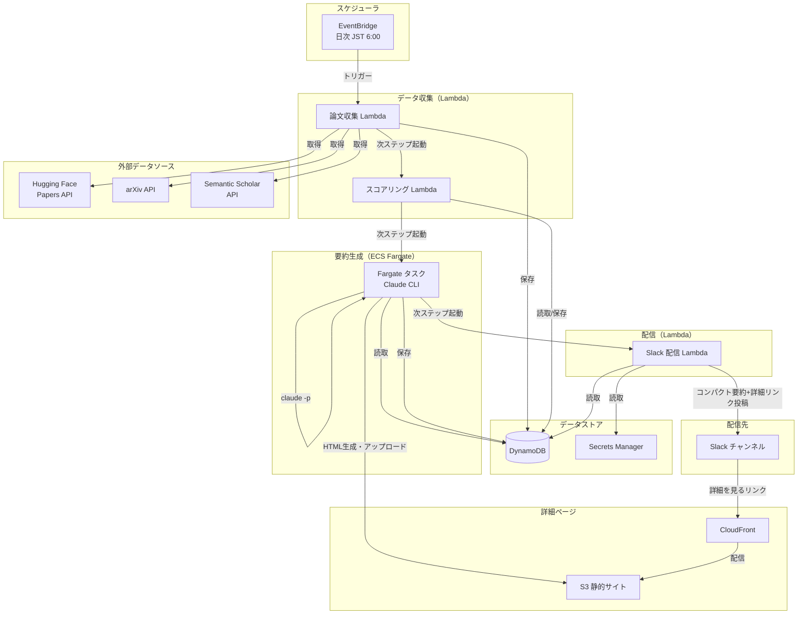
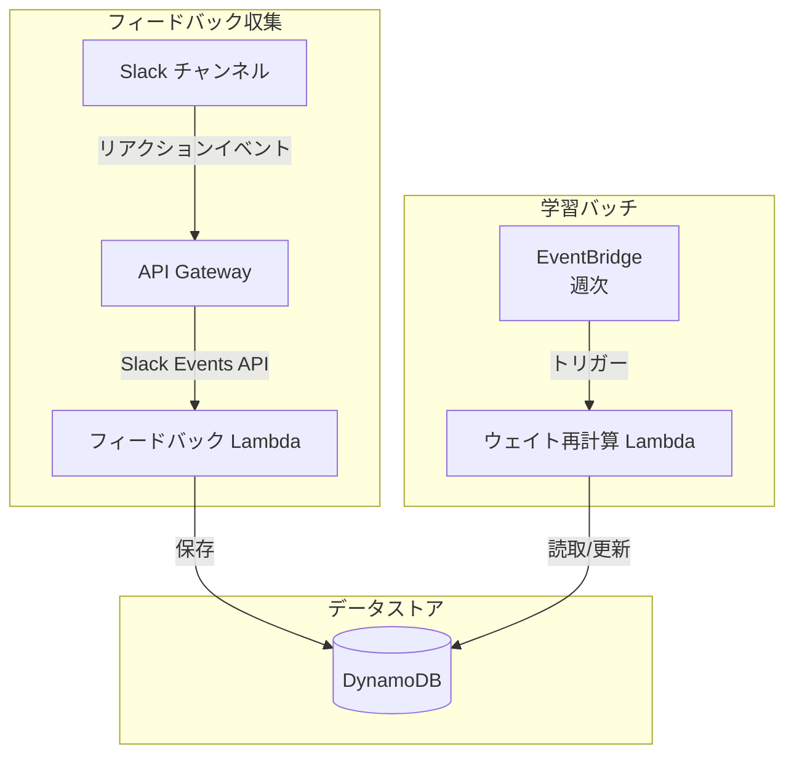
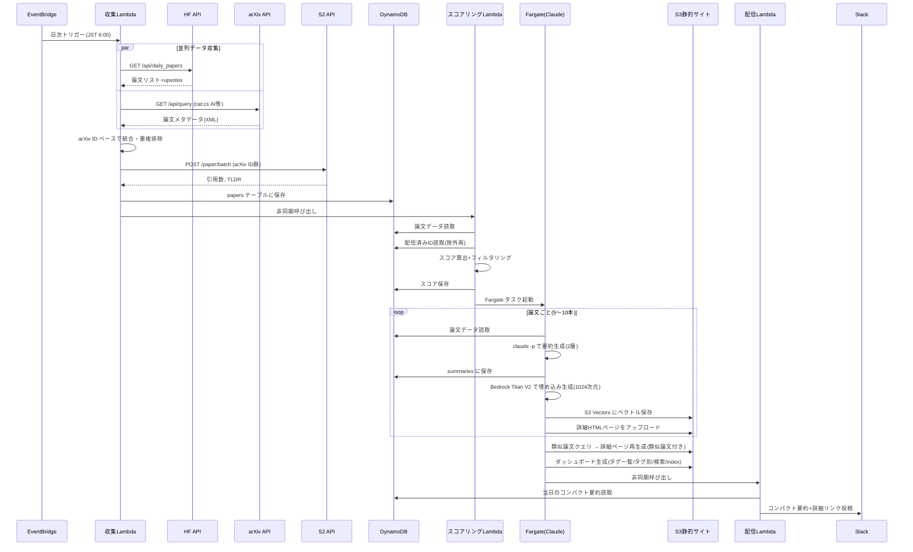
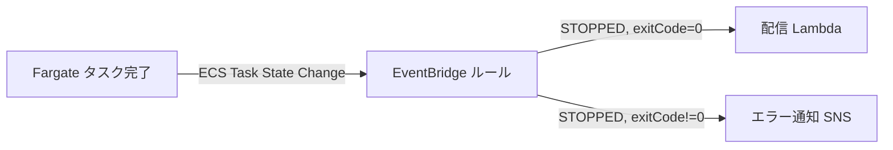
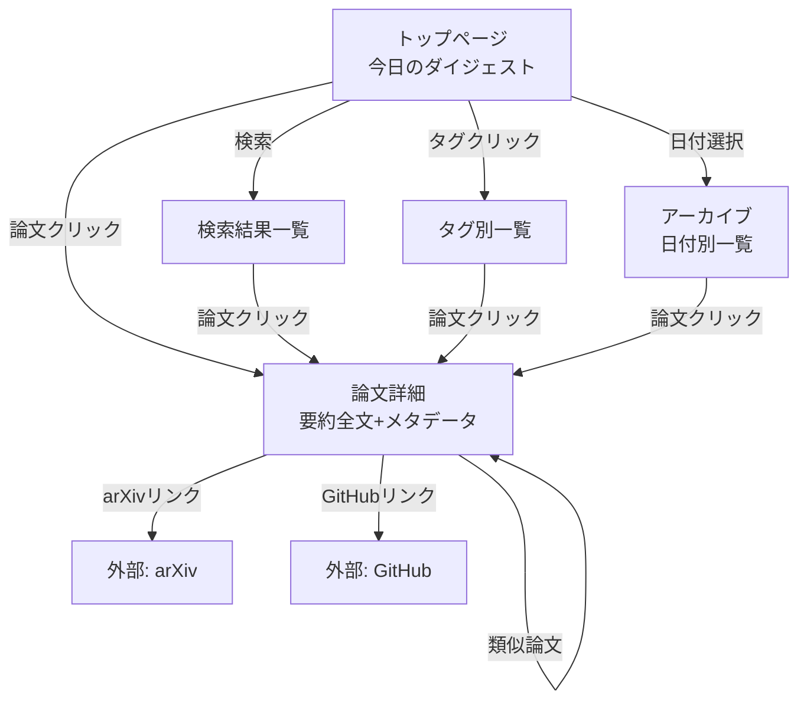

# 機能設計書

## 1. システム構成図

### 全体アーキテクチャ（Phase 1）



### Phase 2 追加コンポーネント



## 2. パイプラインフロー

### 日次バッチ処理フロー



## 3. コンポーネント設計

### 3.1 論文収集 Lambda（collector）

**責務:** 3つの外部APIから論文データを収集・統合し、DynamoDB に保存する

**入力:** EventBridge スケジュールイベント

**処理フロー:**
1. Hugging Face Daily Papers API を呼び出し（当日分）
2. arXiv Search API を呼び出し（前日〜当日の新着、対象カテゴリ）
3. 取得した論文を arXiv ID ベースで統合・重複排除
4. Semantic Scholar Batch API で引用数・TLDR を補完
5. DynamoDB `papers` テーブルに upsert
6. スコアリング Lambda を非同期呼び出し

**外部API呼び出し仕様:**

| API | エンドポイント | パラメータ | レート制限対策 |
|-----|---------------|-----------|---------------|
| HF Daily Papers | `GET /api/daily_papers?date={today}` | date=YYYY-MM-DD | 単発リクエスト |
| arXiv Search | `GET /api/query?search_query=cat:{category}&sortBy=submittedDate&sortOrder=descending&max_results=50` | カテゴリごとに実行 | 3秒間隔で順次実行 |
| S2 Batch | `POST /paper/batch` | body: {"ids": ["ArXiv:{id}", ...]} | 1 RPS |

**エラーハンドリング:**
- 各API呼び出しは独立。1つが失敗しても他のソースで継続
- リトライ: 最大3回、指数バックオフ
- 全ソース失敗時: CloudWatch Alarm → SNS 通知

### 3.2 スコアリング Lambda（scorer）

**責務:** 収集した論文に注目度スコアを付与し、上位論文を選出する

**入力:** 収集 Lambda からの非同期呼び出し（日付パラメータ）

**スコアリングアルゴリズム:**

```
正規化関数: normalize(x, values) = (x - min(values)) / (max(values) - min(values) + ε)

score = w1 × normalize(hf_upvotes)
      + w2 × normalize(citation_count)
      + w3 × normalize(source_count)    # 1:arXivのみ, 2:arXiv+HF, 3:arXiv+HF+S2
      + w4 × feedback_bonus             # Phase 2 で有効化、初期値=0

初期ウェイト: w1=0.4, w2=0.2, w3=0.2, w4=0.2
```

**フィルタリング条件:**
1. 過去に配信済みの arXiv ID を除外（`delivery_log` テーブル参照）
2. スコア上位 N 本を選出（N はパラメータ、デフォルト=7）
3. 最低スコア閾値を下回る論文は除外（閾値はパラメータ）

**出力:** 選出された論文IDリスト → ECS Fargate タスク起動

### 3.3 要約生成 Fargate タスク（summarizer）

**責務:** 選出された論文の日本語要約（2層構造）を Claude CLI で生成し、S3 に詳細ページをアップロードする

**実行環境:**
- ECS Fargate（CPU: 0.5 vCPU, Memory: 1GB）
- Docker イメージ: Node.js ベース + Claude CLI インストール済み
- Claude Max プランの認証情報はタスク起動時に環境変数で渡す
- S3 バケットへの書き込み権限（タスクロールで付与）

**処理フロー（論文ごと）:**
1. DynamoDB から論文データ読取（タイトル、アブストラクト、TLDR、ai_summary）
2. プロンプトを構築
3. `claude -p --output-format json` で2層要約を同時生成
4. JSON レスポンスをパース
5. HF ai_summary が存在する場合、品質比較（LLM-as-judge）
6. 最終要約を DynamoDB `summaries` テーブルに保存
7. 詳細要約から HTML ページを生成し S3 にアップロード

**プロンプト設計:**

```
以下のAI論文の情報を元に、AIエンジニア向けの日本語要約を2種類作成してください。

## 論文情報
- タイトル: {title}
- arXiv アブストラクト: {abstract}
- Semantic Scholar TLDR: {tldr}
- Hugging Face AI Summary: {ai_summary}

## 出力フォーマット（JSON）
{
  "title_original": "原題",
  "title_ja": "日本語タイトル",
  "compact_summary": "コンパクト要約（200〜400文字）。この論文の新規性・手法・結果のエッセンスを1段落で凝縮。AIエンジニアが『この論文を深読みすべきか』を判断できる密度で書くこと。",
  "detail": {
    "novelty": "新規性（何が新しいか、2-3文）",
    "method": "手法（技術的アプローチ、2-3文）",
    "results": "結果（主要な実験結果・ベンチマーク、2-3文）",
    "practicality": "実装可能性（実務での活用可能性、1-2文）"
  },
  "tags": ["タグ1", "タグ2", "タグ3"]
}

## 要約のガイドライン
- compact_summary は必ず200〜400文字（日本語）に収めること
- compact_summary は新規性・手法・結果を凝縮した1段落で、冗長な前置きは不要
- detail の各セクションは技術的に正確で、用語は原文の意味を保持すること
- 日本語として自然で簡潔であること
- タグはAI分野のサブカテゴリ（例: LLM, Vision, RL, Diffusion, Transformer, RAG 等）
```

**品質比較ロジック（HF ai_summary が存在する場合）:**

```
品質スコア = claude -p で以下を評価:
  "以下の2つの要約を比較し、AIエンジニア向けの有用性を1-10で評価してください"
  → 高スコアの要約を採用（ただし2層構造テンプレートへの整形は実施）
```

**S3 詳細ページ生成:**

- HTMLテンプレートに詳細要約データを埋め込み
- アップロード先: `s3://{bucket}/papers/{arxiv_id}.html`
- CloudFront 経由の公開URL: `https://{domain}/papers/{arxiv_id}.html`
- 日次ダイジェストページも生成: `s3://{bucket}/digest/{YYYY-MM-DD}.html`

### 3.4 Slack 配信 Lambda（deliverer）

**責務:** コンパクト要約を Slack チャンネルに配信する（詳細はS3ページへリンク）

**入力:** Fargate タスク完了後の非同期呼び出し（日付パラメータ）

**Slack Block Kit メッセージ構造（1論文あたり）:**

```json
{
  "blocks": [
    {
      "type": "section",
      "text": {
        "type": "mrkdwn",
        "text": "*📄 {title_original}*\n_{title_ja}_\n\n{compact_summary}\n\n🏷️ `{tag1}` `{tag2}` `{tag3}`"
      }
    },
    {
      "type": "actions",
      "elements": [
        {
          "type": "button",
          "text": {"type": "plain_text", "text": "📋 詳細を見る"},
          "url": "https://{domain}/papers/{arxiv_id}.html",
          "style": "primary"
        },
        {
          "type": "button",
          "text": {"type": "plain_text", "text": "📖 arXiv"},
          "url": "https://arxiv.org/abs/{arxiv_id}"
        }
      ]
    },
    {
      "type": "divider"
    }
  ]
}
```

**Slack メッセージのサイズ見積もり（1論文あたり）:**

| 要素 | 文字数目安 |
|------|----------|
| タイトル（原題+日本語訳） | 80〜150文字 |
| コンパクト要約 | 200〜400文字 |
| タグ | 30〜50文字 |
| **合計（テキスト部分）** | **310〜600文字** |

→ Slack の section ブロック上限（3,000文字）に対して十分余裕あり。スクロール負荷も軽い。

**配信ルール:**
- 最初にヘッダーメッセージ（日付 + 本日の論文数 + 日次ダイジェストページリンク）
- 論文ごとに1メッセージ（スレッドではなくチャンネル直投稿）
- 各論文メッセージは独立（リアクション収集のため）
- 👍/👎 リアクションを促すフッターテキスト付き

### 3.5 フィードバック収集 Lambda（feedback-collector）【Phase 2】

**責務:** Slack リアクションイベントを受信し、フィードバックを保存する

**入力:** Slack Events API → API Gateway → Lambda

**Slack Events API 設定:**
- イベントタイプ: `reaction_added`, `reaction_removed`
- 対象リアクション: `+1`（👍）, `-1`（👎）

**処理フロー:**
1. リアクションイベント受信
2. メッセージの `ts`（タイムスタンプ）から対応する `arxiv_id` を特定
3. DynamoDB `feedback` テーブルに保存/更新
4. `reaction_removed` の場合はレコード削除

### 3.6 ウェイト再計算 Lambda（weight-adjuster）【Phase 2】

**責務:** フィードバックデータに基づきスコアリングウェイトを動的調整する

**入力:** EventBridge 週次スケジュール

**処理フロー:**
1. 過去4週間のフィードバックデータを集計
2. Like された論文の特徴ベクトル（カテゴリ分布、タグ分布）を算出
3. 全ユーザー集約の嗜好プロファイルを更新
4. スコアリングウェイト（w1〜w4）を最適化
5. DynamoDB `config` テーブルにウェイトを保存

**ウェイト調整ロジック:**
```
各ウェイト要素の「予測力」を評価:
  - hf_upvotes が高い論文が Like される率
  - citation_count が高い論文が Like される率
  - source_count が多い論文が Like される率

予測力が高い要素のウェイトを上げ、低い要素のウェイトを下げる
ウェイトの合計は常に 1.0 に正規化
最小ウェイト: 0.05（いずれの要素も完全には無視しない）
```

## 4. データモデル定義

### ER図

```mermaid
erDiagram
    PAPERS ||--o{ SUMMARIES : "has"
    PAPERS ||--o{ FEEDBACK : "receives"
    PAPERS ||--o{ PAPER_SOURCES : "collected_from"
    DELIVERY_LOG ||--o{ DELIVERY_ITEMS : "contains"
    CONFIG ||--|| CONFIG : "singleton"

    PAPERS {
        string arxiv_id PK "arXiv ID (例: 2603.18718)"
        string title "論文タイトル（英語）"
        string[] authors "著者リスト"
        string abstract "arXiv アブストラクト"
        string[] categories "arXiv カテゴリ"
        string published_date "arXiv 公開日"
        int hf_upvotes "Hugging Face upvote数"
        string hf_ai_summary "HF AI要約"
        string[] hf_ai_keywords "HF AIキーワード"
        string github_repo "関連GitHubリポジトリURL"
        int s2_citation_count "Semantic Scholar 引用数"
        string s2_tldr "Semantic Scholar TLDR"
        float score "注目度スコア"
        int source_count "出現ソース数"
        string collected_at "収集日時(ISO8601)"
    }

    SUMMARIES {
        string arxiv_id PK "arXiv ID"
        string summary_version SK "バージョン (v1, v2, ...)"
        string title_ja "日本語タイトル"
        string compact_summary "コンパクト要約(200-400文字,Slack用)"
        string detail_novelty "詳細:新規性"
        string detail_method "詳細:手法"
        string detail_results "詳細:結果"
        string detail_practicality "詳細:実装可能性"
        string[] tags "分野タグ"
        string source "生成元 (claude/hf_ai_summary)"
        float quality_score "品質スコア"
        boolean is_active "採用中フラグ"
        string detail_page_url "S3詳細ページURL"
        string created_at "生成日時(ISO8601)"
    }

    FEEDBACK {
        string user_id PK "Slack ユーザーID"
        string arxiv_id SK "arXiv ID"
        string reaction "like/dislike"
        string slack_message_ts "Slackメッセージタイムスタンプ"
        string created_at "評価日時(ISO8601)"
        string updated_at "更新日時(ISO8601)"
    }

    PAPER_SOURCES {
        string arxiv_id PK "arXiv ID"
        string source SK "ソース名 (arxiv/huggingface/semantic_scholar)"
        string raw_data "ソースからの生データ(JSON)"
        string fetched_at "取得日時(ISO8601)"
    }

    DELIVERY_LOG {
        string date PK "配信日 (YYYY-MM-DD)"
        string status "配信ステータス (pending/completed/failed)"
        string[] paper_ids "配信論文IDリスト"
        int paper_count "配信論文数"
        string started_at "処理開始日時"
        string completed_at "処理完了日時"
    }

    DELIVERY_ITEMS {
        string date PK "配信日"
        string arxiv_id SK "arXiv ID"
        string slack_message_ts "Slackメッセージタイムスタンプ"
        int like_count "Like数"
        int dislike_count "Dislike数"
    }

    CONFIG {
        string key PK "設定キー"
        string value "設定値(JSON)"
        string updated_at "更新日時"
    }
```

### DynamoDB テーブル設計

#### papers テーブル
| 属性 | キー | 型 | 説明 |
|------|------|-----|------|
| arxiv_id | PK | S | arXiv ID |
| title | - | S | 論文タイトル |
| authors | - | L | 著者リスト |
| abstract | - | S | アブストラクト |
| categories | - | SS | カテゴリセット |
| published_date | - | S | 公開日 |
| hf_upvotes | - | N | HF upvote数 |
| hf_ai_summary | - | S | HF AI要約 |
| s2_citation_count | - | N | 引用数 |
| s2_tldr | - | S | TLDR |
| score | - | N | 注目度スコア |
| source_count | - | N | ソース出現数 |
| collected_at | - | S | 収集日時 |

**GSI:** `score-index` (PK=collected_date, SK=score) — 日付ごとのスコアランキング取得用

#### summaries テーブル
| 属性 | キー | 型 | 説明 |
|------|------|-----|------|
| arxiv_id | PK | S | arXiv ID |
| summary_version | SK | S | バージョン |
| title_ja | - | S | 日本語タイトル |
| compact_summary | - | S | コンパクト要約（200〜400文字、Slack配信用） |
| detail_novelty | - | S | 詳細: 新規性 |
| detail_method | - | S | 詳細: 手法 |
| detail_results | - | S | 詳細: 結果 |
| detail_practicality | - | S | 詳細: 実装可能性 |
| tags | - | SS | 分野タグ |
| quality_score | - | N | 品質スコア |
| is_active | - | BOOL | 採用中フラグ |
| detail_page_url | - | S | S3 詳細ページURL |
| created_at | - | S | 生成日時 |

#### feedback テーブル
| 属性 | キー | 型 | 説明 |
|------|------|-----|------|
| user_id | PK | S | Slack ユーザーID |
| arxiv_id | SK | S | arXiv ID |
| reaction | - | S | like / dislike |
| slack_message_ts | - | S | メッセージTS |
| created_at | - | S | 評価日時 |

**GSI:** `paper-feedback-index` (PK=arxiv_id, SK=created_at) — 論文ごとのフィードバック集計用

#### delivery_log テーブル
| 属性 | キー | 型 | 説明 |
|------|------|-----|------|
| date | PK | S | 配信日 (YYYY-MM-DD) |
| arxiv_id | SK | S | arXiv ID |
| slack_message_ts | - | S | メッセージTS |
| status | - | S | 配信ステータス |
| like_count | - | N | Like数 |
| dislike_count | - | N | Dislike数 |

#### config テーブル
| 属性 | キー | 型 | 説明 |
|------|------|-----|------|
| key | PK | S | 設定キー（例: scoring_weights） |
| value | - | S | JSON文字列 |
| updated_at | - | S | 更新日時 |

**初期データ:**
```json
{
  "key": "scoring_weights",
  "value": "{\"w1\": 0.4, \"w2\": 0.2, \"w3\": 0.2, \"w4\": 0.2}",
  "updated_at": "2026-03-27T00:00:00Z"
}
```

## 5. ステップ間連携設計

### Lambda 間の呼び出しパターン

```
EventBridge → collector Lambda → (非同期) scorer Lambda → (ECS RunTask) Fargate[要約生成+S3アップロード] → (非同期) deliverer Lambda
```

**連携方法:**
- Lambda → Lambda: `Lambda.invoke(InvocationType='Event')` （非同期）
- Lambda → Fargate: `ECS.runTask()` でタスク起動。Fargate 内で要約生成 + S3 詳細ページアップロードを実行。タスク完了を EventBridge ルール (`ECS Task State Change`) で検知し、deliverer Lambda をトリガー
- エラー伝播: 各ステップが独立してリトライ。失敗時は `delivery_log` に `failed` ステータスを記録

### ECS タスク完了 → 配信 Lambda のトリガー



## 6. Slack 連携設計

### Phase 1: 配信（Incoming Webhook）

**設定:**
- Slack App を作成し、Incoming Webhook を有効化
- Webhook URL を Secrets Manager に保存
- 配信先チャンネル: `#ai-papers-digest`

### Phase 2: フィードバック収集（Events API + Interactivity）

**設定:**
- Slack App に Events API を追加
- Request URL: API Gateway エンドポイント
- Subscribe to bot events: `reaction_added`, `reaction_removed`
- Bot Token Scopes: `channels:history`, `reactions:read`

**Slack メッセージ ↔ 論文 ID のマッピング:**
- 配信時に `delivery_log` テーブルに `{date, arxiv_id, slack_message_ts}` を保存
- リアクションイベントの `item.ts` で `slack_message_ts` を照合して `arxiv_id` を特定

## 7. 詳細ページ・画面設計

### Phase 1: S3 静的詳細ページ

Phase 1 から S3 + CloudFront で論文ごとの詳細ページをホスティングする。
Slack のコンパクト要約から「📋 詳細を見る」リンクで遷移する。

```mermaid
graph LR
    SL[Slack コンパクト要約] -->|詳細を見る| DETAIL[S3: 論文詳細ページ<br/>/papers/{arxiv_id}.html]
    SL -->|arXiv| EXT[外部: arXiv]
    DETAIL -->|arXivリンク| EXT
    DETAIL -->|GitHubリンク| GH[外部: GitHub]
```

#### ワイヤフレーム: 論文詳細ページ（Phase 1 — S3 静的）

```
┌─────────────────────────────────────────────────────┐
│  🤖 AI Papers Digest                               │
├─────────────────────────────────────────────────────┤
│                                                     │
│  📄 Attention Is All You Need... Again              │
│  注意機構は再びあなたが必要とするもの...                 │
│                                                     │
│  著者: A. Smith, B. Jones, C. Lee                   │
│  公開日: 2026-03-26  |  カテゴリ: cs.CL, cs.AI      │
│  HF Upvotes: 45  |  引用数: 3  |  スコア: 0.87      │
│                                                     │
│  ─────────────────────────────────────────────────  │
│                                                     │
│  🆕 新規性                                           │
│  従来のマルチヘッドアテンションを...                    │
│                                                     │
│  🔧 手法                                             │
│  提案手法では、クエリとキーの計算に...                   │
│                                                     │
│  📊 結果                                             │
│  GLUE ベンチマークで SOTA を達成...                    │
│                                                     │
│  💡 実装可能性                                        │
│  HuggingFace Transformersライブラリで...              │
│                                                     │
│  ─────────────────────────────────────────────────  │
│                                                     │
│  🏷️ [LLM] [Transformer] [Efficiency]               │
│                                                     │
│  [📖 arXiv で読む] [💻 GitHub]                       │
│                                                     │
└─────────────────────────────────────────────────────┘
```

### Phase 3: Web ダッシュボード（S3 詳細ページを拡張）



### ワイヤフレーム: トップページ

```
┌─────────────────────────────────────────────────────┐
│  🤖 AI Papers Digest                    [🔍 検索]  │
├─────────────────────────────────────────────────────┤
│  📅 2026-03-27（木）  7本の論文                      │
├─────────────────────────────────────────────────────┤
│                                                     │
│  ┌─────────────────────────────────────────────┐   │
│  │ 📄 Attention Is All You Need... Again       │   │
│  │    注意機構は再びあなたが必要とするもの...        │   │
│  │                                             │   │
│  │ 🎯 既存のTransformerの注意機構を...           │   │
│  │                                             │   │
│  │ 🏷️ [LLM] [Transformer] [Efficiency]        │   │
│  │                                             │   │
│  │ 👍 12  👎 1   ⭐ スコア: 0.87               │   │
│  │                                             │   │
│  │ [📖 arXiv] [💻 GitHub]                      │   │
│  └─────────────────────────────────────────────┘   │
│                                                     │
│  ┌─────────────────────────────────────────────┐   │
│  │ 📄 次の論文カード...                          │   │
│  └─────────────────────────────────────────────┘   │
│                                                     │
├─────────────────────────────────────────────────────┤
│  [< 前日] [今日] [次の日 >]                          │
└─────────────────────────────────────────────────────┘
```

### ワイヤフレーム: 論文詳細ページ

```
┌─────────────────────────────────────────────────────┐
│  🤖 AI Papers Digest          [← 一覧に戻る]       │
├─────────────────────────────────────────────────────┤
│                                                     │
│  📄 Attention Is All You Need... Again              │
│  注意機構は再びあなたが必要とするもの...                 │
│                                                     │
│  著者: A. Smith, B. Jones, C. Lee                   │
│  公開日: 2026-03-26  |  カテゴリ: cs.CL, cs.AI      │
│  HF Upvotes: 45  |  引用数: 3                       │
│                                                     │
│  ─────────────────────────────────────────────────  │
│                                                     │
│  🎯 一言サマリー                                     │
│  既存のTransformerアーキテクチャの注意機構を再設計...   │
│                                                     │
│  🆕 新規性                                           │
│  従来のマルチヘッドアテンションを...                    │
│                                                     │
│  🔧 手法                                             │
│  提案手法では、クエリとキーの計算に...                   │
│                                                     │
│  📊 結果                                             │
│  GLUE ベンチマークで SOTA を達成...                    │
│                                                     │
│  💡 実装可能性                                        │
│  HuggingFace Transformersライブラリで...              │
│                                                     │
│  ─────────────────────────────────────────────────  │
│                                                     │
│  🏷️ [LLM] [Transformer] [Efficiency]               │
│                                                     │
│  [📖 arXiv で読む] [💻 GitHub]  [👍 Like] [👎]      │
│                                                     │
│  ─────────────────────────────────────────────────  │
│                                                     │
│  📌 類似論文                                         │
│  - FlashAttention-3: ...                            │
│  - Linear Attention Revisited: ...                  │
│                                                     │
└─────────────────────────────────────────────────────┘
```

## 8. エラーハンドリング設計

### エラー分類と対応

| エラー種別 | 発生箇所 | 対応 | 通知 |
|-----------|---------|------|------|
| API レート制限 | collector | 指数バックオフで自動リトライ（最大3回） | 3回失敗で CloudWatch Alarm |
| API タイムアウト | collector | 30秒タイムアウト、該当ソースをスキップして続行 | ログ記録のみ |
| Claude CLI エラー | summarizer | 論文単位でリトライ（最大2回）、失敗論文はスキップ | 3本以上失敗で Alarm |
| Claude レート制限 | summarizer | 論文間に30秒のインターバルを設定 | ログ記録 |
| Slack 配信失敗 | deliverer | リトライ（最大3回） | 即座に Alarm |
| DynamoDB スロットリング | 全体 | SDK自動リトライ + バックオフ | 頻発時に Alarm |

### Dead Letter Queue (DLQ)

```
各 Lambda に SQS DLQ を設定
→ DLQ にメッセージが入った場合、CloudWatch Alarm → SNS → メール通知
→ 手動確認後にリドライブ
```
